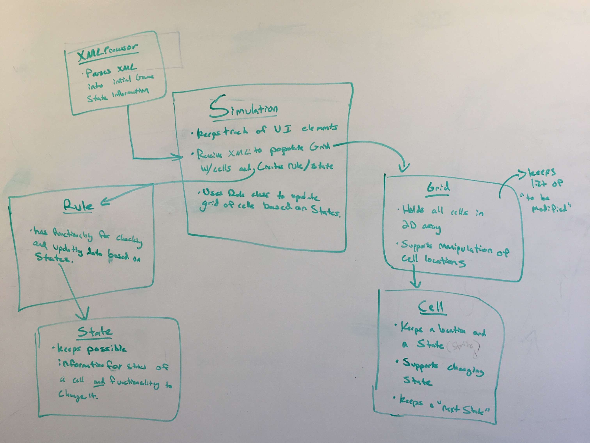
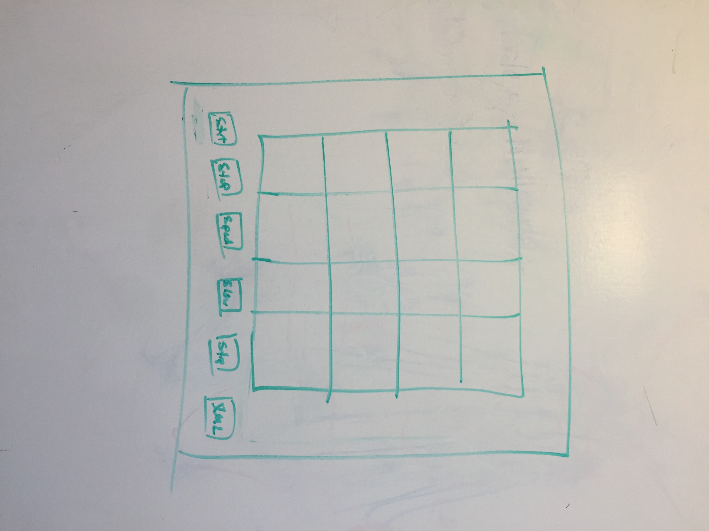

CS308 Cell Society - Team 21 Design
===================

### Introduction

* Problem: Trying to simulate different cell automata models
* Primary Design Goals: Should be able to accommodate different types of simulations
* Primary Architecture:
    - Closed: Rules for simulations, states for specific simulations
    -  Open: Which simulations it supports, UI elements

### Overview

To tackle the given problem, we intend to implement a Simulation class, a Grid class, a Cell class, an XMLParser class, an abstract Rule class with subclasses for each simulation, and an abstract State class, also with subclasses for each simulation. 

The Simulation class will be responsible for controlling the flow of the simulation, including initializing it and controlling the simulation loop based on input from the user (e.g. start, stop, step, pause, resume). As such, it will also be responsible for the GUI elements.

The XMLParser class will be responsible for initializing the Simulation state. The Simulation class will use the XMLParser class to parse the selected XML file, and the XMLParser class will parse the XML file and create the Rule and State subclasses that correspond to the simulation encoded by the XML. The XMLParser will also use the initial state of the Grid encoded by the ML to initialize the Grid object, then return the Rule, State, and Grid objects to the Simulation.

The Grid class will hold the locations of each cell and will be responsible for the simulation logic. It will apply the rules to each of the cell it holds and update them correspondingly, then return a rendered version of the grid to the Simulation at the end of each simulation step.

The Cell class will hold the current state and location for an individual cell, as well as its next state, all of which will be updated by the Grid based on the rules.

The Rule subclasses will hold the rules for each particular simulation, and given a cell, its location, and its neighbors, it should be able to determine whether or not that cell must be updated and what its next state should be.

The State subclasses will hold the possible states for each particular simulation as well as what updates must be applied for a cell to become a particular state (e.g. change display color).

### User Interface

(Sorry about the orientation)
* The user interface will have five buttons along the bottom of the screen:
    * Start
    * Stop
    * Step
    * Speed Up
    * Slow Down
    * Load XML
* The user interface will also have each cell displayed as a grid above the row of buttons. The grid will have a fixed total size but fill itself with evenly sized and spaced cells.
* The XML load button will allow us to load an xml file describing the initial state of a game, which set of rules we are using, and then prepares the game to be run once "start" or "step" is pressed.
* Whenever the XML load button is pressed, it will stop the game having the same effect as the stop button, and then load a new XML. The user interface will also say at all times what is the current game and set of rules loaded.

### Design Details
**Use Cases**

1. Apply the rules to a middle cell:
  * `Grid.get(row,col)` to get the cell
  * `Grid.getNeighbors(Cell myCell)`
  * Check the cell against the rule
  * If the cell needs to be updated, add to list in Grid
  * Apply `Grid.updateState(Cell myCell)` to all cells in the list
  * Update the cell's state if necessary

2. Apply the rules to an edge cell
  * `Grid.get(row,col)` to get the cell
  * `Grid.getNeighbors(Cell myCell)` (The logic in getNeighbors will implement bounds checking)
  * Check the cell against the rule
  * If the cell needs to be updated, add to list in Grid
  * Apply `Grid.updateState(Cell myCell)` to all cells in the list
  * Update the cell's state if necessary

3. Move to the next generation
  * `Simulation.step()` (The simulation loop)
  * Calls `Grid.updateState()` which loops through the list of cells that need to be updated and updates their states
  * Calls `Grid.render()` which returns a UI group that contains all the nodes to be presented in the UI

4. Set a simulation parameter
  * Simulation passes file name to XML parser
  * XML parser parses and identifies game type and parameters
  * The parser returns a Rule and State object corresponding to the simulation
    - E.g. `FireRules(probCatch)`

5. Switch Simulations
  * Stop the simulation loop
  * Call `Simulation.init()` again, which will repeat the initial loading sequence

### Design Considerations
* When discussing design, we considered the following different design decisions:
    * We spent a lot of time trying to decide how to encapsulate the information of the rules and represent it. We ultimately decided to create a rule and state subclass for each set of rules. Each rule subclass would hold the logic for that game, and each state subclass would the possible states for that set of rules.
    * We decided to track cell location through a grid class, and track cell state as two String instance variables in the Cell class, one as the current state and one as the future state, as well as a list of cell "to be modified" in the Grid class.
    * We decided that loading a new XML file would stop the current game's execution, populate the Grid, Rule, and State instance variables in the Simulation class to the new information.

### Team Responsibilities
* Amy: Basic skeleton/interface of Rule, State, Grid, Cell
* Blake: XML parser and writer
* Austin: UI and button functionality- Simulation class
